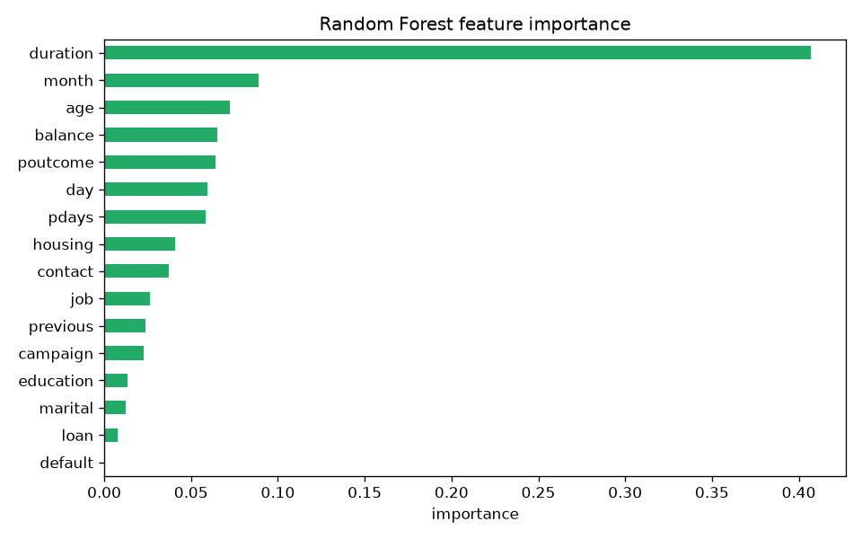

# bankmind-saritha

BankMind Challenge submission for **Track C - System Builder**.

[](https://github.com/tharanisaritha46-alt/bankmind-saritha_tharani/actions/workflows/ci.yml)

This project predicts whether a bank customer is likely to subscribe to a term
deposit using the UCI Bank Marketing dataset (`bank-full.csv`) and serves the
trained model through a FastAPI API.

Track C includes Track B work: focused EDA, a Logistic Regression baseline, a
Random Forest main model, model evaluation, feature importance, and 5 readable
sample predictions. The written answers are in `EXPLANATION.md`.

## Live Demo

The API is deployed on Render.

| Link | URL |
|---|---|
| Health check | <https://bankmind-saritha.onrender.com/health> |
| Swagger / FastAPI docs | <https://bankmind-saritha.onrender.com/docs> |
| OpenAPI schema | <https://bankmind-saritha.onrender.com/openapi.json> |

Quick live test:

```bash
curl https://bankmind-saritha.onrender.com/health
```

Live prediction example:

```bash
curl -X POST https://bankmind-saritha.onrender.com/predict \
  -H "Content-Type: application/json" \
  -d '{"age":64,"job":"retired","balance":7000,"housing":"no","loan":"no","duration":600}'
```

Live Groq explanation example:

```bash
curl -X POST https://bankmind-saritha.onrender.com/explain \
  -H "Content-Type: application/json" \
  -d '{"age":64,"job":"retired","balance":7000,"housing":"no","loan":"no","duration":600}'
```

## Reviewer Checklist

- Track C FastAPI service: `/health`, `/predict`, `/explain`
- Track B model work: Logistic Regression baseline vs Random Forest
- Saved model artifact: `model/model.pkl`
- Required write-up: `EXPLANATION.md`
- Step-by-step process: `PROJECT_PROCESS.md`
- Live deployment: Render links above
- CI smoke test: GitHub Actions badge above

## Results

Test set: 20% stratified split, `random_state=42`.

| Metric | Logistic Regression | Random Forest |
|---|---:|---:|
| Accuracy | 0.81 | **0.90** |
| Precision (yes) | 0.36 | **0.56** |
| Recall (yes) | **0.80** | 0.69 |
| F1 (yes) | 0.50 | **0.62** |

Class balance: **11.70%** of customers subscribed (`y = yes`).

Top feature by importance: `duration`. This is useful for explaining the model,
but it is also target leakage because the call duration is only known after the
customer has already been contacted. I discuss this in `EXPLANATION.md`.



## Project Structure

```text
bankmind/preprocessing.py   Shared loading, defaults, and encoding helpers
train.py                    Trains LR + RF, evaluates, saves model/model.pkl
api/app.py                  FastAPI app with /health, /predict, /explain
smoke_test.py               Quick local API smoke test
data/bank-full.csv          UCI Bank Marketing dataset
model/model.pkl             Saved Random Forest artifact
EXPLANATION.md              Required challenge explanation answers
PROJECT_PROCESS.md          Step-by-step build explanation
requirements.txt            Python dependencies
render.yaml                 Optional Render deployment config
```

## Setup

```bash
python -m venv .venv
source .venv/bin/activate
pip install -r requirements.txt
```

On Windows PowerShell:

```powershell
python -m venv .venv
.\.venv\Scripts\Activate.ps1
pip install -r requirements.txt
```

## Train the Model

```bash
python train.py
```

This prints:

- dataset shape, missing values, and class distribution
- Logistic Regression and Random Forest metrics
- `classification_report` for both models
- Random Forest feature importance
- 5 readable sample predictions with probabilities

It also saves the model artifact to `model/model.pkl`.

## Quick Smoke Test

```bash
python smoke_test.py
```

This checks `/health`, `/predict`, and `/explain` without starting a separate
server.

## Run the API

```bash
uvicorn api.app:app --reload
```

Open FastAPI docs at:

```text
http://127.0.0.1:8000/docs
```

## Endpoints

### GET /health

```bash
curl http://127.0.0.1:8000/health
```

Example response:

```json
{"status":"ok","model":"Random Forest","yes_rate":0.117}
```

### POST /predict

```bash
curl -X POST http://127.0.0.1:8000/predict \
  -H "Content-Type: application/json" \
  -d '{"age":64,"job":"retired","balance":7000,"housing":"no","loan":"no","duration":600}'
```

Example response:

```json
{
  "will_subscribe": true,
  "probability": 0.6372,
  "top_factors": [
    "long last-contact duration",
    "older customer (often retired)",
    "high account balance"
  ]
}
```

### POST /explain

This is the bonus endpoint. It uses Groq when `GROQ_API_KEY` is set. If no key is
available, it returns a deterministic fallback explanation so the API still
works during review.

```bash
export GROQ_API_KEY=your_key_here
export GROQ_MODEL=llama-3.3-70b-versatile
```

Windows PowerShell:

```powershell
$env:GROQ_API_KEY="your_key_here"
$env:GROQ_MODEL="llama-3.3-70b-versatile"
```

Request:

```bash
curl -X POST http://127.0.0.1:8000/explain \
  -H "Content-Type: application/json" \
  -d '{"age":64,"job":"retired","balance":7000,"housing":"no","loan":"no","duration":600}'
```

## Notes

- `duration` is the strongest predictor but is target leakage. In a production
  pre-call recommendation system, I would remove it and retrain the model.
- The API accepts partial customer payloads. Missing fields are filled with
  dataset-derived defaults from the training artifact.
- `.env.example` shows the optional Groq environment variables.
- `render.yaml` is included for optional Render deployment.
